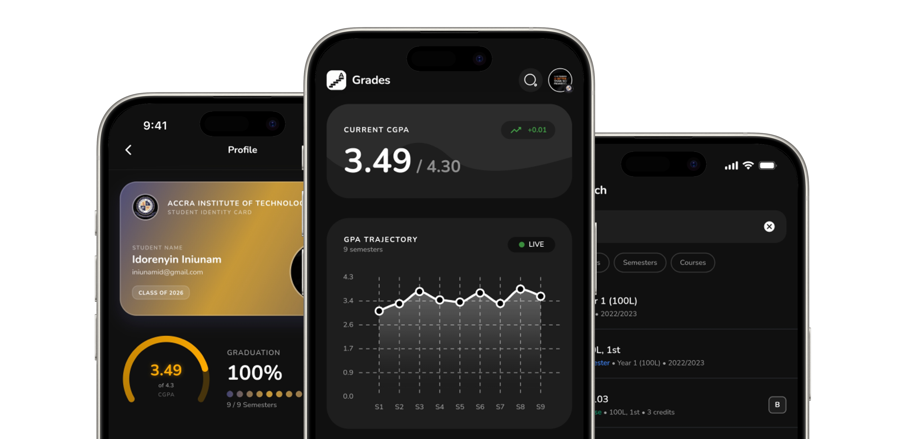
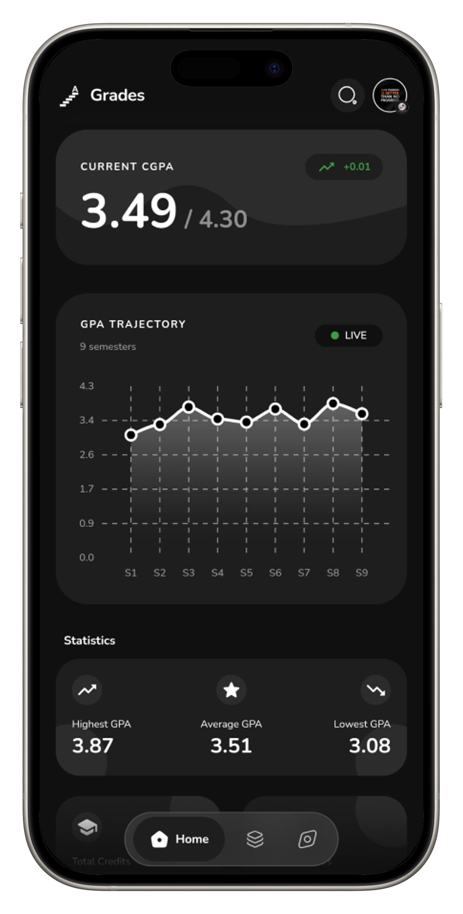
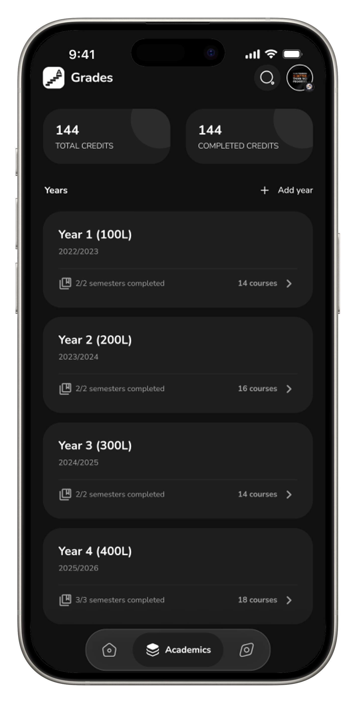
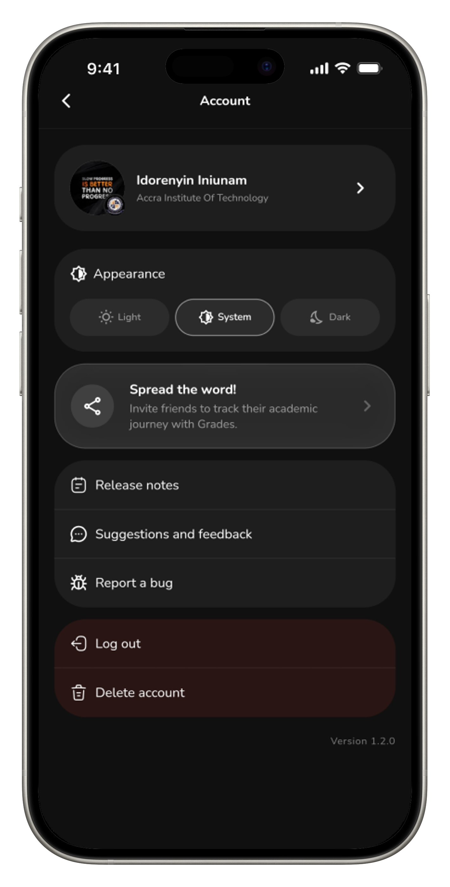
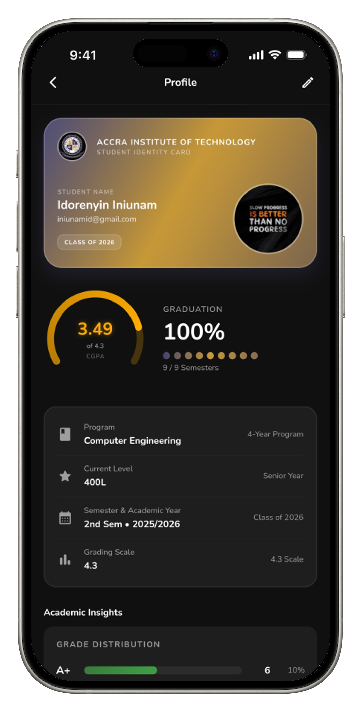
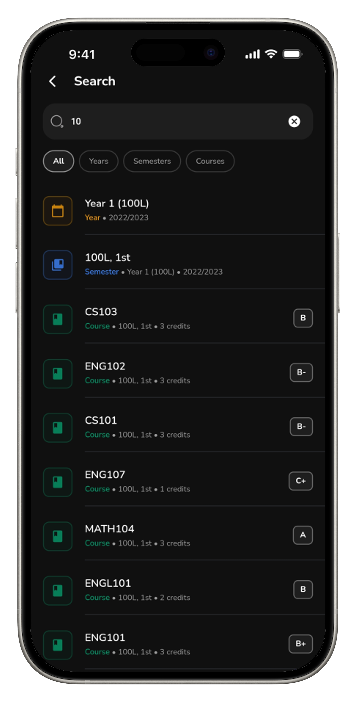
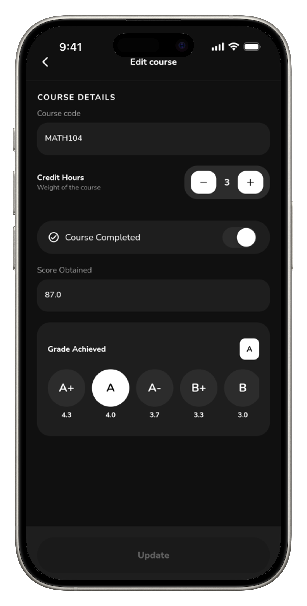
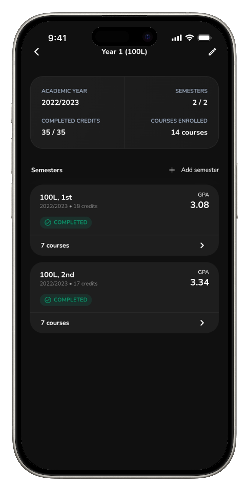
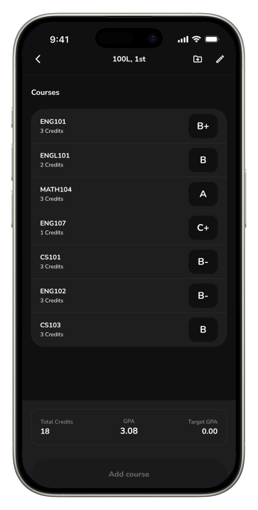

#  Grades

A Flutter app for tracking GPA, and monitoring academic progress in real time, with full offline support.

<p align="center">
  
</p>

---

## 🔗 Links

* 📱 Download App: [Play Store](https://play.google.com/store/apps/details?id=com.iniunamid.scholr)
<!-- * 🎥 Demo Video: [Add video link] -->

---

## 🚀 Key Capabilities

* Supports multiple and custom grading scales (4.0, 4.3, 5.0, etc.)
* Custom letter grade mappings per institution
* Weighted GPA calculations across semesters
* Automatic grouping of semesters into academic years
* Shared core logic powering both mobile and admin apps
<!--* Target grade simulation to reach a desired CGPA -->

---

## 💡 Engineering Decisions

### Shared Core Engine (`grades_core`)

* **What:** Extracted all GPA logic and domain models into a pure Dart package
* **Why:** Keeps business logic separate from UI and allows reuse across mobile and admin apps without duplication

### Store + ViewModel Pattern

* **What:** Centralized Stores handle realtime data, while ViewModels manage screen logic
* **Why:** Keeps UI clean and separates global app state from temporary screen state

### Network-Aware ViewModel

* **What:** Connectivity checks and UI events handled inside `BaseViewModel`
* **Why:** Prevents failed requests and provides consistent handling for errors, toasts, and retries

---

## 🧪 Production Readiness

* Offline-first experience using Firestore caching
* Realtime updates with snapshot listeners
* Network-aware write protection
* Crash tracking with Firebase Crashlytics
* Remote Config for feature flags and updates without redeploying

---

## 📦 Architecture

* `grades_app` → Flutter mobile client
* `grades_admin` → Admin dashboard
* `grades_core` → Shared business logic and models

```text
grades/
 ├── grades_app/
 ├── grades_admin/
 └── grades_core/
```

This structure keeps logic reusable, testable, and independent from UI layers.

---

## 📱 Gallery

<p align="center">
  
  
  
  
</p>

<p align="center">
  
  
  
  
</p>
